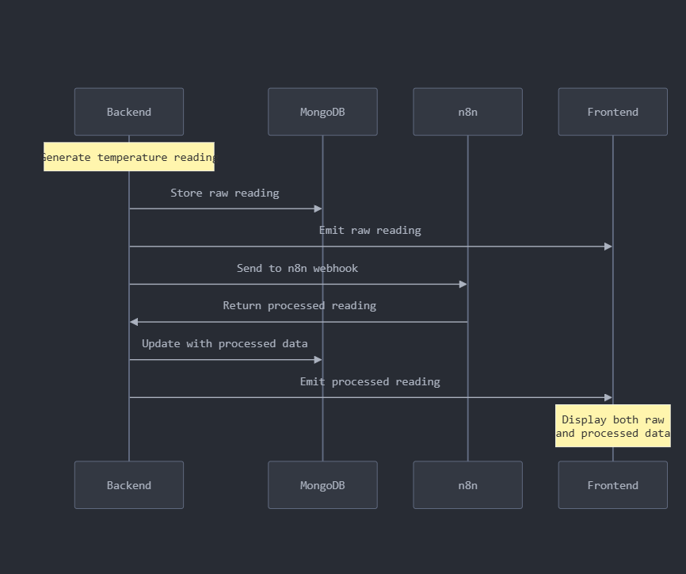
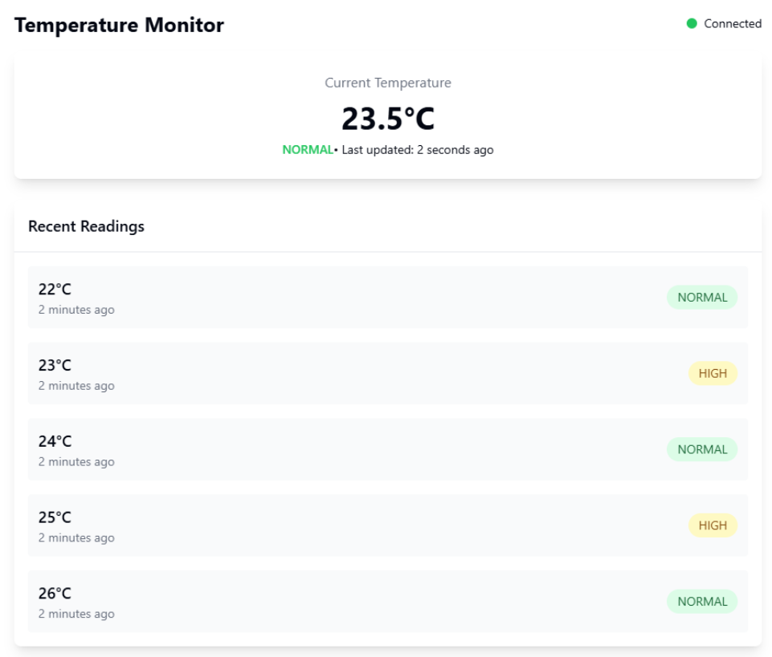

# Real-Time Temperature Monitoring System Challenge 🚀

Welcome to our Senior Full-Stack Developer technical challenge! This challenge invites you to build a modern, real-time temperature monitoring system that showcases your expertise in full-stack development and microservices architecture.

## 🎯 Challenge Overview

Create a sophisticated real-time temperature monitoring system that processes and visualizes temperature data through a modern web interface. Your solution will demonstrate your ability to:

-   Implement real-time data streams
-   Design service-oriented architecture
-   Create responsive user interfaces
-   Integrate workflow automation
-   Handle distributed system challenges

## 🏗️ System Architecture



The system comprises four main components:

-   **Frontend**: Real-time dashboard built with React
-   **Backend**: Node.js service for data generation and processing
-   **Database**: MongoDB for data persistence
-   **Processing**: n8n workflow (preferred) or Node.js processing service

### Processing Approach Options

1. **Preferred Approach: n8n Workflow Integration**

    - Implement temperature processing using n8n workflows
    - Demonstrates ability to work with workflow automation tools
    - Shows understanding of service integration

2. **Alternative Approach: Node.js Processing**
    - Implement temperature processing directly in Node.js
    - Use if n8n integration presents significant challenges
    - Must maintain same data flow and processing logic

## 💡 Core Features

### Main Dashboard



-   Real-time temperature display (2-second updates)
-   Connection status indicator
-   Last 5 readings with timestamps
-   Status badges (NORMAL/HIGH) updated after processing
    -   Initial reading shows temperature only
    -   Status updates post-processing

## ⏱️ Time Expectations

While you have 24 hours to submit, expect to spend 2-3 hours of focused development time. The window allows for:

-   Core implementation
-   Documentation
-   Testing and refinement
-   Optional n8n workflow setup

## 📋 Submission Requirements

### Repository Structure

```
your-solution/
├── frontend/
│   ├── src/
│   └── Dockerfile
├── backend/
│   ├── src/
│   └── Dockerfile
├── n8n/               # If using n8n approach
│   └── workflows/
├── docker-compose.yml
└── README.md
```

### Required Documentation

1. Setup Instructions
2. API Documentation
3. Architecture Overview
4. Processing Approach Documentation
    - Clearly indicate chosen approach
    - Explain implementation decisions

## 🎯 Evaluation Criteria

### Technical Excellence (40%)

-   Code quality and organization
-   System architecture
-   Performance considerations
-   Error handling
-   Testing approach

### Feature Implementation (30%)

-   Real-time functionality
-   Data processing implementation
    -   n8n implementation (+10 bonus points)
    -   Node.js implementation (standard points)
-   UI/UX execution
-   Service integration

### Best Practices (30%)

-   Documentation quality
-   Git practices
-   Code organization
-   Development setup

## 🚀 Getting Started

1. Review `specification.md`
2. Choose processing approach
3. Begin implementation

## 📮 Submission Process

1. Create a public GitHub repository
2. Implement your solution
3. Add comprehensive documentation
4. Share the repository URL

## 🎯 Success Criteria

Your solution should demonstrate:

-   Clean, maintainable code
-   Robust real-time data handling
-   Thoughtful architecture decisions
-   Professional documentation
-   Successful processing implementation (either approach)

Ready to showcase your expertise? Let's see what you can build! 🚀

## 🤝 Questions?

For any clarifications, feel free to reach out via LinkedIn.
