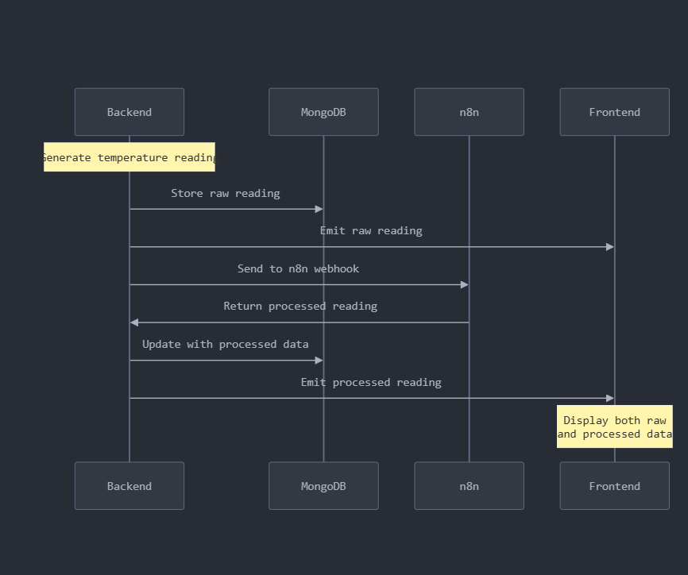

# Temperature Monitoring System

[](https://github.com/yourusername/temp-monitor/actions)
[](https://codecov.io/gh/yourusername/temp-monitor)
[](https://opensource.org/licenses/MIT)


Real-time temperature monitoring system with automated alerts, featuring:
- React frontend dashboard
- Node.js backend with WebSocket support
- MongoDB for data storage
- n8n workflow automation
- Docker-based deployment



## Table of Contents
- [Prerequisites](#prerequisites)
- [Quick Start](#quick-start)
- [Development Setup](#development-setup)
- [Testing](#testing)
- [Documentation](#documentation)
- [Troubleshooting](#troubleshooting)
- [License](#license)

## Prerequisites

- Docker 20.10+
- Docker Compose 2.17+
- Node.js 18.x & npm 9.x (for local development)
- Modern web browser

## Quick Start

1. **Clone the repository**
   ```bash
   git clone https://github.com/yashahmad/temperature-monitoring-system.git
   cd temperature-monitoring-system
   ```
2. **Start all services**
   ``docker compose up --build```
3. ** Access services**
   ```
    Frontend: http://localhost:5173
    Backend API: http://localhost:5000
    MongoDB: mongodb://localhost:27017
    n8n Dashboard: http://localhost:5678
    ```
## For N8N, import the workflow file in N8N/workflow.json, and start the execution, then restart other services (especially backend, for the first initialization, then it will persist the data)
